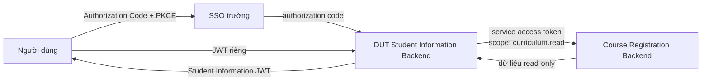
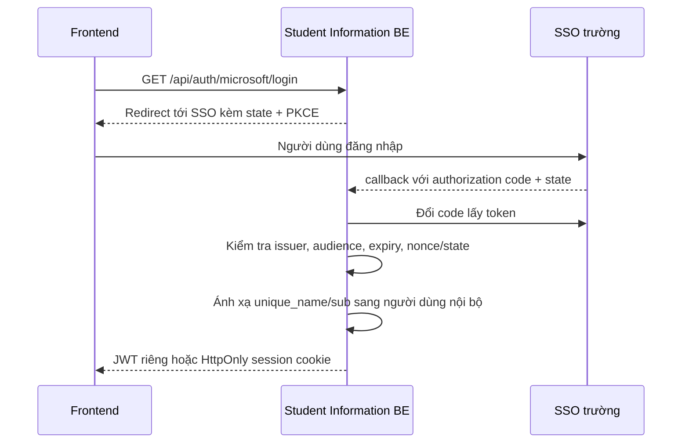
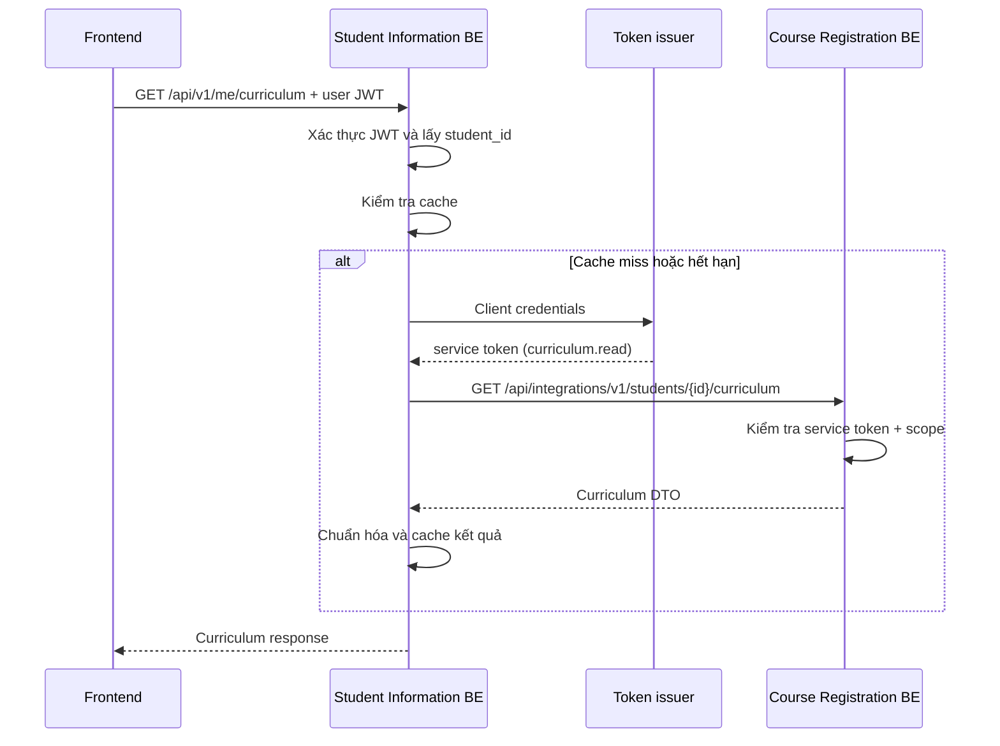

# Thiết kế SSO và tích hợp Course Registration

## 1. Mục tiêu

Tài liệu này mô tả cách DUT Student Information Backend:

- đăng nhập người dùng qua Microsoft OAuth/OIDC và SSO của trường;
- phát JWT riêng cho ứng dụng Student Information;
- đọc khung chương trình đào tạo từ Course Registration Backend;
- không chia sẻ khóa JWT giữa hai backend;
- không tạo hoặc ghi đè phiên đăng nhập của sinh viên trên hệ thống đăng ký tín chỉ.

Thiết kế chỉ cấp quyền **đọc** dữ liệu chương trình đào tạo. Các thao tác đăng ký,
hủy học phần hoặc quản trị không nằm trong phạm vi tích hợp này.

## 2. Hiện trạng cần lưu ý

Course Registration đang sử dụng ba bước xác thực:

1. Nhận SSO token và kiểm tra bằng `JwtSettings:SSOSecretKey`.
2. Ánh xạ claim `unique_name` sang tài khoản sinh viên nội bộ.
3. Phát Course Registration JWT và lưu token hiện hành trong Redis.

Phiên hiện hành được lưu theo khóa:

```text
ActiveToken:<role>:<studentId>
```

Mỗi sinh viên chỉ có một token hiện hành. Nếu Student Information Backend gọi
`POST /api/microsoft/course-registration-token`, token mới có thể ghi đè phiên
đang được sử dụng trên trang đăng ký tín chỉ. Vì vậy endpoint này **không được sử
dụng cho tích hợp backend-to-backend**.

Các token phải được xem là ba loại thông tin xác thực độc lập:

| Token | Nơi phát hành | Audience dự kiến | Mục đích |
|---|---|---|---|
| SSO access/ID token | SSO của trường | SSO client hoặc API được chỉ định | Xác minh danh tính người dùng |
| Student Information JWT | Backend hiện tại | `student-information-api` | Gọi API của Student Information |
| Course Registration JWT | Course Registration | `course-registration-api` | Phiên người dùng trên trang đăng ký tín chỉ |

JWT của một hệ thống không được dùng như JWT của hệ thống còn lại.

## 3. Quyết định kiến trúc

Course Registration cung cấp một nhóm API integration read-only dành cho
backend. Student Information gọi nhóm API này bằng **service access token**, không
dùng Course Registration JWT của sinh viên.



### Nguyên tắc

- Browser chỉ nhận Student Information JWT hoặc session cookie của ứng dụng này.
- Browser không nhận service token.
- SSO token không được truyền trong query string.
- Student Information Backend không biết `JwtSettings:SecretKey` của Course
  Registration.
- API integration không ghi vào `ActiveToken:*` và không chạy kiểm tra phiên
  Redis dành cho người dùng.
- Quyền của service token được giới hạn bằng scope `curriculum.read`.
- Dữ liệu trả về được chuẩn hóa tại Student Information Backend, không chuyển
  nguyên response nội bộ cho frontend.

## 4. Luồng đăng nhập người dùng

Luồng nên sử dụng OAuth 2.0 Authorization Code và PKCE:



JWT do Student Information phát hành tối thiểu nên có:

```json
{
  "iss": "student-information-api",
  "aud": "student-information-client",
  "sub": "stable-user-id",
  "student_id": "102xxxxxx",
  "role": "Student",
  "jti": "unique-token-id",
  "iat": 0,
  "exp": 0
}
```

Không dùng email làm định danh duy nhất nếu SSO cung cấp một `sub`/object ID ổn
định. `unique_name` chỉ nên dùng để ánh xạ khi đó là quy ước bắt buộc của SSO
hiện tại.

## 5. Xác thực backend-to-backend

### Phương án ưu tiên: OAuth client credentials

Đăng ký Student Information Backend như một confidential client tại identity
provider. Backend lấy access token có các claim:

```json
{
  "iss": "https://sso.dut.udn.vn",
  "aud": "course-registration-api",
  "client_id": "student-information-backend",
  "scope": "curriculum.read",
  "exp": 0
}
```

Course Registration phải kiểm tra đầy đủ chữ ký, `iss`, `aud`, `exp` và scope.
Service access token nên sống ngắn, khoảng 5–15 phút, và được cache ở phía server
đến trước thời điểm hết hạn.

### Phương án dự phòng: service JWT bất đối xứng

Nếu SSO chưa hỗ trợ client credentials:

- Student Information ký service JWT bằng private key riêng;
- Course Registration chỉ giữ public key/JWKS để xác minh;
- JWT bắt buộc có `iss`, `aud`, `scope`, `jti`, `iat`, `exp`;
- khóa được định kỳ xoay vòng bằng `kid`;
- không dùng chung symmetric secret với JWT người dùng.

API key tĩnh chỉ nên là giải pháp tạm thời và phải đặt trong secret manager, giới
hạn IP/network, xoay vòng định kỳ và không ghi vào source code.

## 6. API contract đề xuất

### 6.1 API public của Student Information

Frontend gọi endpoint sau bằng Student Information JWT:

```http
GET /api/v1/me/curriculum
Authorization: Bearer <student-information-jwt>
```

Không nhận `studentId` từ query/path. Backend lấy `student_id` từ principal đã
xác thực để tránh lỗi IDOR.

Response chuẩn hóa:

```json
{
  "success": true,
  "data": {
    "program": {
      "id": "PROGRAM_ID",
      "name": "Tên chương trình",
      "facultyId": "FACULTY_ID",
      "majorId": "MAJOR_ID",
      "totalCredits": 150
    },
    "semesters": [
      {
        "semester": 1,
        "courses": [
          {
            "id": "COURSE_ID",
            "name": "Tên học phần",
            "credits": 3,
            "required": true
          }
        ]
      }
    ]
  },
  "meta": {
    "source": "course-registration",
    "fetchedAt": "2026-10-01T00:00:00.000Z"
  }
}
```

### 6.2 API integration tại Course Registration

Endpoint lấy chương trình của một sinh viên:

```http
GET /api/integrations/v1/students/{studentId}/curriculum
Authorization: Bearer <service-access-token>
```

Yêu cầu quyền:

```text
audience = course-registration-api
scope contains curriculum.read
client_id = student-information-backend
```

Nếu nhiều sinh viên dùng chung một chương trình, có thể tách thêm endpoint để
tận dụng cache:

```http
GET /api/integrations/v1/academic-programs/{programId}/curriculum
Authorization: Bearer <service-access-token>
```

API integration chỉ expose các trường cần thiết, không trả mật khẩu, token, dữ
liệu học phí hoặc thông tin cá nhân không liên quan.

## 7. Luồng lấy khung chương trình



## 8. Tổ chức module trong repository hiện tại

```text
src/modules/
|-- auth/
|   |-- config/
|   |-- controllers/
|   |-- middlewares/
|   |-- routes/
|   |-- services/
|   `-- utils/
`-- curriculum/
    |-- config/
    |-- controllers/
    |-- clients/
    |   `-- course-registration.client.js
    |-- middlewares/
    |-- routes/
    |-- services/
    |   `-- curriculum.service.js
    |-- utils/
    `-- index.js
```

Trách nhiệm:

- `auth`: callback SSO, xác thực token, ánh xạ người dùng, phát/thu hồi JWT riêng.
- `curriculum.controller`: nhận request và trả response chuẩn hóa.
- `curriculum.service`: điều phối cache và nghiệp vụ.
- `course-registration.client`: lấy service token, timeout, retry có giới hạn và
  gọi Course Registration.
- `curriculum.config`: base URL, audience, scope, timeout và cache TTL.

## 9. Cache và khả năng chịu lỗi

- Cache theo `programId` thay vì `studentId` nếu nội dung chương trình giống nhau.
- TTL đề xuất ban đầu: 15–60 phút.
- Course Registration nên trả `ETag` hoặc `updatedAt/version` để hỗ trợ
  revalidation.
- HTTP client phải có timeout rõ ràng, đề xuất 3–5 giây.
- Chỉ retry lỗi mạng, `429` hoặc `5xx`; không retry `400`, `401`, `403`, `404`.
- Có thể phục vụ cache cũ trong thời gian ngắn khi upstream lỗi, đồng thời đánh
  dấu `meta.stale = true`.

Ánh xạ lỗi đề xuất:

| Upstream | Student Information | Ý nghĩa |
|---|---|---|
| `401/403` | `502` và log cảnh báo nội bộ | Sai cấu hình service identity; không đổ lỗi cho người dùng |
| `404` | `404` | Không tìm thấy sinh viên/chương trình |
| `429` | `503` | Upstream đang giới hạn lưu lượng |
| timeout/`5xx` | `503` | Dịch vụ chương trình tạm thời không khả dụng |

Không gửi nội dung lỗi, stack trace hoặc cấu hình bí mật của upstream cho
frontend.

## 10. Yêu cầu bảo mật bắt buộc

### Student Information Backend

- Kiểm tra chữ ký, issuer, audience, expiry và algorithm của SSO/JWT.
- Dùng `state`, `nonce` và PKCE trong luồng OAuth/OIDC.
- Không ghi access token, authorization code hoặc service secret vào log.
- Secret chỉ lấy từ environment/secret manager.
- Rate-limit endpoint đăng nhập và curriculum.
- Audit theo `requestId`, `clientId`, `studentId` đã mask và kết quả; không log
  token.

### Course Registration Backend

- Tách authentication scheme cho integration API và user API.
- Integration API chỉ chấp nhận scope `curriculum.read`.
- Không chạy `ActiveTokenMiddleware` cho service principal; thay vào đó phải xác
  thực integration scheme riêng.
- Bật `ValidateIssuer = true` và `ValidateAudience = true` cho các scheme.
- Đặt default/fallback authorization policy là authenticated và chỉ gắn
  `AllowAnonymous` cho endpoint thực sự public.
- Các endpoint upload/create/update/delete của `AcademicProgramsController` phải
  được bảo vệ; không để chung quyền public với các GET read-only.
- Giới hạn network để integration API chỉ nhận request từ backend/gateway tin cậy
  nếu hạ tầng cho phép.

## 11. Không lựa chọn các phương án sau

1. **Chia sẻ `JwtSettings:SecretKey` giữa hai backend**: tăng blast radius và làm
   hai hệ thống phụ thuộc chặt vào nhau.
2. **Dùng Student Information JWT gọi thẳng Course Registration**: sai audience
   và phá vỡ ranh giới tin cậy.
3. **Đổi SSO token thành Course Registration user JWT cho mỗi request**: ghi đè
   phiên Redis và có thể đăng xuất người dùng ở hệ thống đăng ký tín chỉ.
4. **Gửi SSO/JWT trong query string**: token có thể lọt vào proxy log, browser
   history và monitoring.
5. **Cho frontend gọi integration API trực tiếp**: làm lộ service credential và
   bỏ qua lớp kiểm soát truy cập của Student Information Backend.

## 12. Lộ trình triển khai

### Giai đoạn 1 — Chuẩn hóa bảo mật Course Registration

- Bảo vệ các endpoint mutation đang thiếu authorization.
- Bật validation issuer/audience.
- Thiết lập fallback authorization policy.
- Tách DTO curriculum read-only.

### Giai đoạn 2 — Service identity

- Đăng ký OAuth client và scope `curriculum.read`; hoặc thiết lập asymmetric
  service JWT.
- Tạo integration authentication scheme.
- Thêm audit, rate limit và network policy.

### Giai đoạn 3 — Integration API

- Thêm `/api/integrations/v1/students/{studentId}/curriculum`.
- Thêm endpoint theo `programId` nếu cần cache dùng chung.
- Viết integration test cho `401`, `403`, `404`, success và token hết hạn.

### Giai đoạn 4 — Student Information

- Xây module `auth` và `curriculum`.
- Thêm HTTP client có timeout, token cache và response normalization.
- Expose `GET /api/v1/me/curriculum`.
- Thêm cache, metrics, tracing và kiểm thử end-to-end.

## 13. Tiêu chí hoàn thành

- Một lần đăng nhập SSO cho phép người dùng gọi Student Information API.
- Gọi curriculum không tạo Course Registration user JWT và không thay đổi
  `ActiveToken:*`.
- Service token chỉ có `curriculum.read`, hết hạn ngắn và không xuất hiện ở
  frontend/log.
- Người dùng chỉ đọc được chương trình gắn với danh tính của mình.
- Khi Course Registration lỗi, Student Information trả lỗi ổn định hoặc cache cũ,
  không làm lộ chi tiết nội bộ.
- Đăng nhập Student Information không làm mất phiên đang mở trên trang đăng ký
  tín chỉ.
